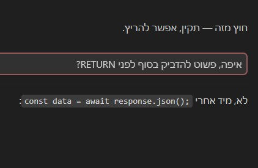
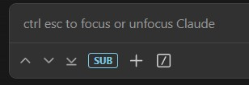
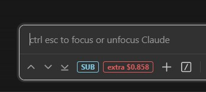
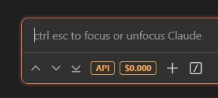

<div dir="rtl">

# תוספות ממשק לקלוד קוד

שיפורים קטנים לחוויית השימוש בתוסף Claude Code ל-VSCode.

---

## פיצ'רים

### מסגרת להודעות משתמש
מסגרת עדינה סביב ההודעות שלך, כדי שתוכל לסרוק את השיחה ולהבדיל בקלות בין הפרומפטים שלך לתשובות של קלוד.
ניתן להדליק/לכבות עם קליק ימני על כפתורי הניווט ↑↓⤓.
צבע ברירת המחדל ניתן לשינוי בקובץ `ui.conf`.

<p align="right"></p>

### הרחבת הודעות משתמש
קלוד קוד מכווץ הודעות ארוכות לכ-3 שורות עם כפתור "הצג עוד". הפיצ'ר הזה מגדיל את המגבלה לכ-7 שורות, כך שהודעות בינוניות נראות במלואן בלי שום לחיצה.

### העתקה כ-Markdown
קליק ימני על טקסט מסומן בשיחה פותח תפריט עם שתי אפשרויות:

<ul dir="rtl">
<li><b>Copy</b><br>מעתיק עם עיצוב מלא, מתאים להדבקה ב-Word, Notion וכדומה</li>
<li><b>Copy as Markdown</b><br>ממיר את הטקסט ל-Markdown גולמי ומעתיק כטקסט רגיל</li>
</ul>

התפריט מופיע רק כשיש טקסט מסומן. בלי סימון — קליק ימני עובד כרגיל.

<p align="right"></p>

### היסטוריית שיחות (רב-שורתי)
קלוד קוד רגיל חותך את שמות השיחות בסיידבר לשורה אחת. הפיצ'ר הזה מאפשר לכל פריט להציג עד 3 שורות, כדי שתוכל לקרוא על מה דובר בשיחה.

<p align="right"></p>

### ניווט בין הודעות (↑ ↓ ⤓)
שלושה כפתורים שמוזרקים לאזור הקלט:

<ul dir="rtl">
<li><b>↑</b> — קפיצה להודעת המשתמש הקודמת</li>
<li><b>↓</b> — קפיצה להודעת המשתמש הבאה</li>
<li><b>⤓</b> — גלילה לתחתית השיחה (אחרי כל ההודעות, כולל התגובה האחרונה)</li>
</ul>

הניווט עוצר בהודעה הראשונה / האחרונה — ללא לולאה.
מדגיש את ההודעה שאליה קפצת עם אנימציית פולס קצרה.

<p align="right"></p>

### תג חשבון ועלות סשן

תג קטן שמופיע מימין לכפתורי הניווט ומציג את סוג החשבון של החלון הנוכחי.
הזיהוי מתבצע בזמן ריצה דרך המסר `get_claude_state_response` שהתוסף שולח לכל חלון בנפרד — כך שכל חלון VSCode מציג את סוג החשבון הנכון שלו, ללא race condition.

</div>

<table>
<tr>
<td align="center"></td>
<td align="right" dir="rtl"><b>SUB</b> (כחול)<br>מנוי Claude.ai — מצב רגיל, ללא תצוגת עלות</td>
</tr>
<tr>
<td align="center"></td>
<td align="right" dir="rtl"><b>SUB + Extra Usage</b> (אדום)<br>עברת את המכסה השעתית — עלות חריגה מצטברת מרגע ה-overage</td>
</tr>
<tr>
<td align="center"></td>
<td align="right" dir="rtl"><b>API</b> (כתום)<br>מפתח API — עלות מצטברת של הסשן, מוצג תמיד</td>
</tr>
</table>

<div dir="rtl">

---

## התקנה דרך קלוד קוד

העתק והדבק את הפקודה הבאה לצ'אט של קלוד קוד:

`Install the Claude Code UI extras (message border + navigation arrows).`

הפקודה המלאה עם כל השלבים נמצאת בגרסה האנגלית למטה.

---

הסקריפט יבצע:

<ul dir="rtl">
<li>הזרקת השיפורים לתוך ה-webview של קלוד קוד</li>
<li>רישום <code>SessionStart</code> hook כדי שההזרקה תתבצע אוטומטית אחרי כל עדכון של קלוד קוד</li>
</ul>

---

## הגדרות

ערוך את `scripts/ui.conf` כדי לשנות את צבע המסגרת:

</div>

```
border_color=rgba(249,131,131,0.5)
```

<div dir="rtl">

לאחר מכן הרץ מחדש את `bash scripts/inject-ui.sh` וטען מחדש את VSCode.

---

## הסרה

מחק את הבלוק המוזרק מתוך `webview/index.js` ו-`webview/index.css`
(חפש `/* Claude UI Extras Patch Start */`), ולאחר מכן הסר את הרשומה מ-`SessionStart` hook ב-`~/.claude/settings.json`.

</div>

---

<details>
<summary>English version</summary>

## Features

### User Message Border
A subtle border around your messages, making it easy to visually separate your prompts from Claude's responses.
Toggle on/off with a right-click on the ↑↓⤓ navigation buttons.
Default color is configurable in `ui.conf`.

<p></p>

### User Message Expand
Claude Code collapses long user messages to ~3 lines with a "show more" button. This fix raises the limit to ~7 lines, so short-to-medium messages are fully visible without any interaction.

### Copy as Markdown
Right-click on any selected text in the conversation to get a context menu with two options:
- **Copy** — copies the selection as rich text (preserves formatting when pasting into Word, Notion, etc.)
- **Copy as Markdown** — converts the selection to raw Markdown (`**bold**`, `# heading`, `` `code` ``, etc.) and copies it as plain text

This menu only appears when text is selected. When nothing is selected, right-click behaves normally.

<p></p>

### Session History (multi-line)
The Claude Code sidebar normally truncates session names to a single line. This fix expands each entry to up to 3 lines, so you can actually read what a session was about.

<p></p>

### Message Navigation (↑ ↓ ⤓)
Three buttons injected into the input footer:
- **↑** — jump to previous user message
- **↓** — jump to next user message
- **⤓** — scroll to the absolute bottom of the conversation (past all messages, including the latest model response)
- Navigation stops at the first / last message — no looping
- Highlights the target message with a brief pulse animation

<p></p>

### Account Badge & Session Cost

A small badge next to the navigation buttons showing the account type. Detection happens at runtime via `get_claude_state_response` — each VSCode window shows its own correct account type, with no race condition.

| | Mode |
|---|---|
|  | **SUB** (blue) — Claude.ai subscription, no cost displayed |
|  | **SUB + Extra Usage** (red) — exceeded hourly quota, shows overage cost since the moment it started |
|  | **API** (orange) — API key, cumulative session cost always visible |

---

## Install via Claude Code

Copy and paste the following into your Claude Code chat:

---

```
Install the Claude Code UI extras (message border + navigation arrows).
Do all these steps:

Step 1 — Create a scripts directory in the current working directory (if it doesn't exist).

Step 2 — Download the script from the repo and save it to scripts/:
  curl -o scripts/inject-ui.sh https://raw.githubusercontent.com/arielmoatti/claude-code-ui-extras/main/inject-ui.sh

Step 3 — Run the script once to apply the fix.

Step 4 — Ask me to do Reload Window (Ctrl+Shift+P → Developer: Reload Window).
```

---

The script will:
- Inject the UI enhancements into Claude Code's webview
- Register a `SessionStart` hook so the injection is re-applied automatically after every Claude Code update

---

## Configuration

Edit `scripts/ui.conf` to change the border color:

```
border_color=rgba(249,131,131,0.5)
```

Then re-run `bash scripts/inject-ui.sh` and reload VSCode.

---

## Uninstall

Delete the injected block from Claude Code's `webview/index.js` and `webview/index.css`
(look for `/* Claude UI Extras Patch Start */`), then remove the `SessionStart` hook from `~/.claude/settings.json`.

</details>
