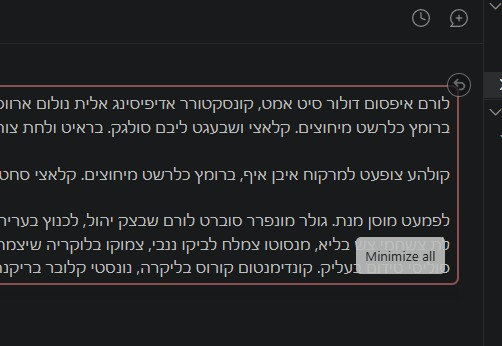
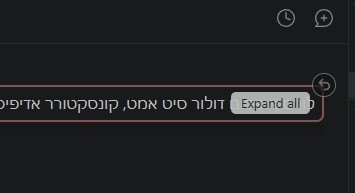
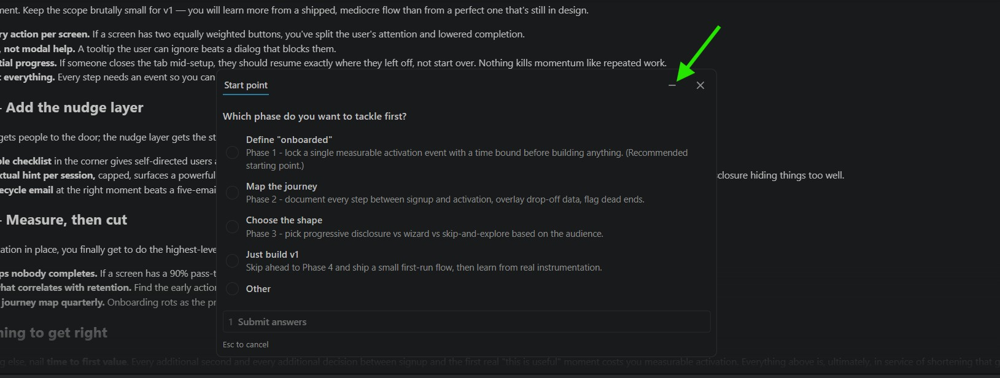
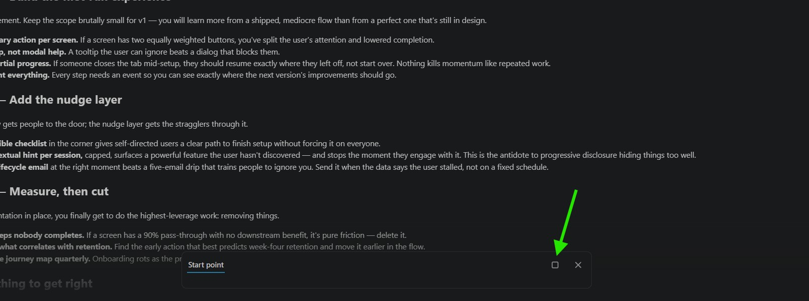
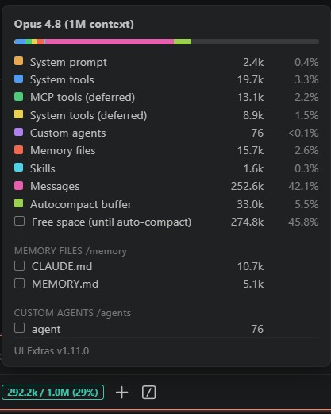
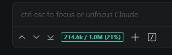
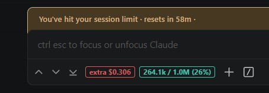
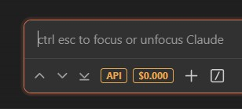
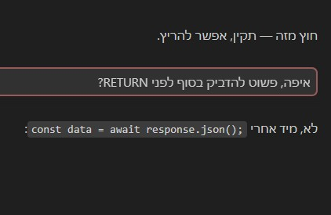

<div dir="rtl">

# תוספות ממשק לקלוד קוד

שיפורים קטנים לחוויית השימוש בתוסף Claude Code ל-VSCode.
הפיצ'רים מסודרים מהחדש ביותר לישן (מי שחוזר לאחר תקופה יראה מיד מה חדש).

---

<blockquote dir="rtl">

💡 <b>משהו לא עובד? התצוגה לא מראה את השיפורים?</b> קודם כל תעשו <b>Reload Window</b>. כשקלוד קוד או VSCode מתעדכנים באמצע העבודה, התצוגה שרצה בזיכרון נשארת עם הגרסה הישנה עד ש-VSCode נטען מחדש. <code>Ctrl+Shift+P</code> ← <code>Developer: Reload Window</code> פותר את זה ברוב המקרים.

</blockquote>

## פיצ'רים

### &rlm;🆕 קיפול כל הפרומפטים לשורה אחת (Minimize all)

<p dir="rtl">ריחוף על הודעת משתמש מציג כפתור <b>Minimize all</b> - לחיצה אחת מקפלת את <b>כל</b> ההודעות שלך בשיחה לשורה אחת, והשיחה הופכת לרשימה קומפקטית שקל לסרוק, עם כל שטח המסך פנוי לתשובות. ריחוף על הודעה מקופלת מציג <b>Expand all</b> שמחזיר את הכל.</p>

<ul dir="rtl">
<li>מצב הקיפול יציב לאורך השיחה - שורד רענוני תוכן ומעבר בין סשנים באותו חלון - עד שמרחיבים או עושים Reload.</li>
<li>הכפתור יושב בדיוק לצד ה-Show more / Show less הנייטיביים, על אותו קו.</li>
<li>פרומפט של שורה אחת לא מקבל כפתור - אין מה לקפל.</li>
<li>אגב, תוקן גם באג נייטיבי: בהודעות בעברית כפתור Show less היה קופץ לפינה השמאלית (ההפוכה) - עכשיו הוא נשאר בפינה הימנית, כמו Show more.</li>
<li>כיבוי: דגל <code dir="ltr">user_msg_minimize</code> ב-<code>ui.conf</code> (ברירת מחדל: דולק).</li>
</ul>

<p align="right"></p>
<p align="right"></p>

### מזעור תיבת השאלות (AskUserQuestion)

<p dir="rtl">כשקלוד שואל שאלה (<code dir="ltr">AskUserQuestion</code>) נפתחת תיבה צפה שמכסה את התשובה שמתחתיה, והדרך היחידה לקרוא את מה שמאחוריה הייתה ללחוץ <code dir="ltr">Esc</code> - מה שמבטל את השאלה. הפיצ'ר מוסיף כפתור <b>מזעור</b> (<code>−</code>) ליד ה-<code dir="ltr">✕</code>.</p>

<ul dir="rtl">
<li>לחיצה על <code>−</code> מקפלת את התיבה לשורה אחת שנדבקת לראש תיבת הפרומפט - והתשובה שמאחוריה נחשפת ונקראת במלואה.</li>
<li>הכפתור מתחלף ל-<code>□</code> (מסגרת) להחזרת התיבה למצב מלא. השאלה לא מבוטלת - היא ממתינה כל הזמן.</li>
<li>ניתן לכבות עם דגל <code>question_minimize</code> ב-<code>ui.conf</code> (ברירת מחדל: דולק).</li>
</ul>

<p align="right"></p>
<p align="right"></p>

### פירוט חלון הקונטקסט (קליק ימני)

<p dir="rtl">קליק ימני על ה-badge של הקונטקסט פותח <b>פירוט מלא של מה שצורך את חלון ההקשר</b>, לפי קטגוריה - בדיוק כמו <code dir="ltr">/context</code> הנייטיב, אבל ישירות מה-badge בלי לפתוח פאנל.</p>

<ul dir="rtl">
<li>פירוק לכל קטגוריה (System prompt, System tools, MCP/System tools deferred, Custom agents, Memory files, Skills, Messages, Autocompact buffer, ו-Free space) עם טוקנים ואחוז לכל אחת, ופס ניצול צבעוני.</li>
<li>רשימת קבצי ה-Memory (<code dir="ltr">/memory</code>) וה-Custom agents (<code dir="ltr">/agents</code>) עם צריכת הטוקנים של כל אחד.</li>
<li>שם המודל מוצג מרונדר (<code dir="ltr">Opus 4.8 (1M context)</code>), עם ה-id הגולמי ב-tooltip.</li>
<li>האחוזים בפירוק מחושבים מול חלון ה-autocompact (נקודת הדחיסה), בעוד ה-badge עצמו מודד מול תקרת המודל המלאה - לכן ייתכן הבדל בין השניים.</li>
</ul>

<p align="right"></p>

### רוחב מותאם לבלוקי קוד + שבירה לשורות

<p dir="rtl">בלוקי קוד (ובלוקים להעתקה) מוגבלים לרוחב שניתן לכוונן - ברירת מחדל 50% מרוחב הצ'אט - ונשברים לשורות במקום גלילה אופקית מעצבנת. השבירה ויזואלית בלבד: הטקסט שמועתק נשאר שורה לוגית אחת לפסקה.</p>

<ul dir="rtl">
<li>הרוחב נקבע ע"י <code dir="ltr">code_block_max_width</code> ב-<code>ui.conf</code> (כל ערך CSS: <code dir="ltr">50%</code>, <code dir="ltr">65%</code>, <code dir="ltr">720px</code>; או <code dir="ltr">100%</code> / <code dir="ltr">none</code> לביטול). ברירת מחדל: <code dir="ltr">50%</code>.</li>
<li>כפתור ההעתקה עוקב אחרי הקצה הימני של הבלוק (לא נדבק לקצה החלון), עם מסגרת בעובי ובצבע של מסגרת הודעות היוזר.</li>
<li>ה-hover שחושף את הכפתור פעיל על כל רוחב השורה, גם מעל האזור הריק מימין לבלוק.</li>
<li>לקבלת copy נקי גם בתוכן (בלי שבירות שורה מלאכותיות) - <a href="#טיפ-גם-copy-נקי-לא-רק-תצוגה-נקייה">ראו את הפרומפט המומלץ למטה, תחת ההגדרות</a>.</li>
</ul>

### חיווי Context Window

<p dir="rtl">‏Badge קטן בפינה הימנית של אזור הקלט שמציג <b>כמה מחלון הקונטקסט של השיחה הנוכחית נצרך כרגע</b>. לכל חלון VSCode חיווי משלו, בהתאם לשיחה שלו.</p>

<ul dir="rtl">
<li>פורמט: <code dir="ltr">349.4k / 1.0M (35%)</code> — טוקנים שנצרכו / תקרת המודל / אחוז</li>
<li>זיהוי אוטומטי של תקרה — 200K או 1M (מודל עם חלון מורחב), מבוסס על ה-usage בפועל</li>
<li>צבעים לפי שימוש: ירוק (&lt;50%), כתום (50-79%), אדום (≥80%)</li>
<li>ניתן לכבות/להדליק עם דגל <code>show_context_window</code> ב-<code>ui.conf</code> (ברירת מחדל: דולק)</li>
</ul>

<p align="right"></p>

### חיווי API + עלות סשן (עודכן)

במצב הרגיל (מנוי Claude.ai) אין שום חיווי — נקי ושקט.
החיווי מופיע **רק** באחד משני המצבים:

<ul dir="rtl">
<li><b>Extra</b> (אדום) — עברת את המכסה השעתית במנוי. מוצג <code dir="ltr">Extra $X.XXX</code> עם עלות חריגה מצטברת מרגע ה-overage</li>
<li><b>API</b> (כתום) — מחובר עם מפתח API. מוצג <code>API</code> + עלות מצטברת של הסשן <code dir="ltr">$X.XXX</code>, תמיד גלוי</li>
</ul>

הזיהוי מתבצע בזמן ריצה דרך המסר `get_claude_state_response` שהתוסף שולח לכל חלון בנפרד — כך שכל חלון VSCode מציג את המצב הנכון שלו.

</div>

<table>
<tr>
<td width="70%" align="center"></td>
<td width="30%" align="right" dir="rtl"><b>Extra</b> (אדום)<br>עברת את המכסה השעתית — עלות חריגה מצטברת מרגע ה-overage</td>
</tr>
<tr>
<td width="70%" align="center"></td>
<td width="30%" align="right" dir="rtl"><b>API</b> (כתום)<br>מפתח API — עלות מצטברת של הסשן, מוצג תמיד</td>
</tr>
</table>

<div dir="rtl">

### ניווט בין הודעות (↑ ↓ ⤓)
שלושה כפתורים שמוזרקים לאזור הקלט:

<ul dir="rtl">
<li><b>↑</b> — קפיצה להודעת המשתמש הקודמת</li>
<li><b>↓</b> — קפיצה להודעת המשתמש הבאה</li>
<li><b>⤓</b> — גלילה לתחתית השיחה (אחרי כל ההודעות, כולל התגובה האחרונה)</li>
</ul>

הניווט עוצר בהודעה הראשונה / האחרונה — ללא לולאה.
מדגיש את ההודעה שאליה קפצת עם אנימציית פולס קצרה.

<p align="right"></p>

### מסגרת להודעות משתמש

מסגרת עדינה סביב ההודעות שלך, כדי שתוכל לסרוק את השיחה ולהבדיל בקלות בין הפרומפטים שלך לתשובות של קלוד.
ניתן להדליק/לכבות עם קליק ימני על כפתורי הניווט ↑↓⤓.
צבע ברירת המחדל ניתן לשינוי בקובץ `ui.conf`.

<p align="right"></p>

### הרחבת הודעות משתמש (עודכן)
קלוד קוד מכווץ הודעות ארוכות לכ-3 שורות עם כפתור "הצג עוד". הפיצ'ר הזה מגדיל את הסף לכ-8 שורות (ניתן לכוונון עם <code dir="ltr">user_msg_max_height</code> ב-<code>ui.conf</code>), כך שהודעות בינוניות נראות במלואן בלי שום לחיצה. בנוסף, ההצללה וכפתור Show more מופיעים רק כשההודעה באמת נחתכת - ולא על הודעות שכבר מוצגות במלואן.

### היסטוריית שיחות (רב-שורתי)
קלוד קוד רגיל חותך את שמות השיחות בסיידבר לשורה אחת. הפיצ'ר הזה מאפשר לכל פריט להציג עד 3 שורות, כדי שתוכל לקרוא על מה דובר בשיחה.

<p align="right"></p>

### העתקה כ-Markdown
קליק ימני על טקסט מסומן בשיחה פותח תפריט עם שתי אפשרויות:

<ul dir="rtl">
<li><b>Copy</b><br>מעתיק עם עיצוב מלא, מתאים להדבקה ב-Word, Notion וכדומה</li>
<li><b>Copy as Markdown</b><br>ממיר את הטקסט ל-Markdown גולמי ומעתיק כטקסט רגיל</li>
</ul>

התפריט מופיע רק כשיש טקסט מסומן. בלי סימון — קליק ימני עובד כרגיל.

<p align="right"></p>

---

## התקנה

### התקנה מהירה (הדבקה לתוך Claude Code)

העתיקו את הבלוק הבא והדביקו אותו לתוך Claude Code — הוא יעשה את השאר:

</div>

<div dir="ltr">

```
Install the Claude Code UI extras (UI enhancements).
Do all these steps:

Step 1 — Create a scripts directory in the current working directory (if it doesn't exist).

Step 2 — Download the install script from the repo and save it to scripts/:
  curl -o scripts/inject-ui.sh https://raw.githubusercontent.com/arielmoatti/claude-code-ui-extras/main/inject-ui.sh

Step 3 — Run the script once (`bash scripts/inject-ui.sh`). This patches the webview and registers a SessionStart hook in ~/.claude/settings.json so the injection re-applies after every extension update.

Step 4 — Ask me to do Reload Window (Ctrl+Shift+P → Developer: Reload Window).
```

</div>

<div dir="rtl">

> **שימו לב:** הפרומפט באנגלית בכוונה — כי קלוד צריך להבין את ההוראות ולבצע אותן.

הסקריפט יבצע:

<ul dir="rtl">
<li>הזרקת שיפורי ה-UI לתוך ה-<code>webview</code> של קלוד קוד</li>
<li>רישום <code>SessionStart</code> hook כדי שההזרקה תבוצע אוטומטית אחרי כל עדכון של התוסף</li>
</ul>

### התקנה ידנית

<ol dir="rtl">
<li>הורידו את <code dir="ltr">inject-ui.sh</code> לתיקיית <code dir="ltr">scripts/</code> בפרויקט</li>
<li>הריצו <code dir="ltr">bash scripts/inject-ui.sh</code></li>
<li>עשו Reload Window ב-VSCode (<code dir="ltr">Ctrl+Shift+P → Developer: Reload Window</code>)</li>
</ol>

---

## הגדרות

ערוך את `scripts/ui.conf` - הפרמטרים הנתמכים כוללים:

</div>

```
# צבע מסגרת הודעות משתמש (כל ערך CSS תקין)
border_color=rgba(249,131,131,0.5)

# הצגת badge של Context Window (true / false)
show_context_window=true

# רוחב מרבי לבלוקי קוד - הקופסה נשברת לשורות במקום גלילה אופקית
# (כל ערך CSS: 50%, 65%, 720px; או 100% / none לביטול). ברירת מחדל: 50%
code_block_max_width=50%

# כפתור מזעור על תיבת השאלות (true / false) - ברירת מחדל: דולק
question_minimize=true

# כפתור Minimize all על הודעות משתמש (true / false) - ברירת מחדל: דולק
user_msg_minimize=true

# גובה הכיווץ של הודעות משתמש ארוכות, בפיקסלים (ברירת מחדל: 175, בערך 8 שורות)
user_msg_max_height=175
```

<div dir="rtl">

לאחר מכן הרץ מחדש את `bash scripts/inject-ui.sh` וטען מחדש את VSCode.

### טיפ: גם copy נקי, לא רק תצוגה נקייה

ה-CSS מתקן את ה**תצוגה** לכולם - שבירה לשורות במקום גלילה אופקית. אבל אם הטקסט שמועתק מהבלוק נושא שבירות שורה מלאכותיות, הן נדבקות יחד איתו. כדי שגם ה**העתקה** תהיה נקייה, בקש מ-Claude לא לשבור פסקאות פרוזה בתוך בלוקים. הוסף את הפרומפט הבא ל-`~/.claude/CLAUDE.md` (תופס בכל סשן), או הדבק אותו בתחילת שיחה:

</div>

````
Inside fenced ``` blocks that hold prose/text for copy-paste (messages, emails, posts), do not hard-wrap: one paragraph per line, rely on soft-wrap, blank line between paragraphs. In blocks holding real code, JSON, tables, or lists, keep newlines exactly as written.
````

<div dir="rtl">

---

## הסרה

**הסרה אוטומטית (מומלץ).** הרצה אחת ב-PowerShell מסירה הכל בצורה חלקה - כל הבלוקים המוזרקים מכל גרסאות ה-webview, הסקריפטים שהותקנו, וה-hooks מ-`settings.json` - עם גיבוי לכל קובץ שנערך:

```powershell
irm https://raw.githubusercontent.com/arielmoatti/claude-code-ui-extras/main/uninstall.ps1 | iex
```

ואז Reload Window. הסקריפט גנרי (מסיר כל בלוק `Claude UI Extras ... Start/End`, אז הוא תקף גם לגרסאות עתידיות) ולא נוגע בחבילת ה-RTL הנפרדת. רוצה לבדוק לפני הרצה? פתח את [`uninstall.ps1`](uninstall.ps1).

**הסרה ידנית (אם מעדיפים).** מחק את הבלוק המוזרק מתוך `webview/index.js` ו-`webview/index.css` (חפש `/* Claude UI Extras Patch Start */`), והסר את הרשומה מ-`SessionStart` hook ב-`~/.claude/settings.json`.

</div>

---

<details>
<summary>English version</summary>

> [!TIP]
> 💡 **Something not working? The UI isn't showing the patches?** First try **Reload Window**. When Claude Code or VSCode updates while you're working, the in-memory webview stays on the old version until VSCode reloads. `Ctrl+Shift+P` → `Developer: Reload Window` fixes it in most cases.

## Features

Ordered newest-first — when you come back after a while, the top of the list shows what's new.

### 🆕 Minimize all prompts to one line

Hovering any user message reveals a **Minimize all** button - one click folds ALL your prompts in the chat to a single line each, turning the conversation into a compact, scannable list with the whole screen left for Claude's answers. Hovering a folded message shows **Expand all** to restore everything.

- The folded state is stable throughout the session - it survives content re-renders and session switches in the same window - until you expand or reload.
- The button sits right next to the native Show more / Show less, on the same baseline.
- Single-line prompts don't get the button (nothing to fold).
- Also fixes a native quirk: in RTL (Hebrew) messages the Show less button used to jump to the opposite (left) corner - it now stays in the right corner like Show more.
- Toggle via `user_msg_minimize` in `ui.conf` (default: on).

<p></p>
<p></p>

### Minimize the question box (AskUserQuestion)

When Claude asks a question (`AskUserQuestion`), it opens a floating box that covers the answer underneath it - and the only way to read what's behind it was to press `Esc`, which discards the question. This adds a **minimize** button (`−`) next to the `✕`.

- Clicking `−` collapses the box to a single line parked on top of the prompt box - and the answer behind it is revealed and fully readable.
- The glyph flips to `□` (outline) to restore the box. The question is never discarded - it stays pending the whole time.
- Toggle via `question_minimize` flag in `ui.conf` (default: on).

<p></p>
<p></p>

### Context window breakdown (right-click)

Right-click the context badge to open a **full breakdown of what's filling the context window**, by category - the same data as the native `/context`, but inline on the badge without opening a panel.

- Per-category split (System prompt, System tools, MCP/System tools deferred, Custom agents, Memory files, Skills, Messages, Autocompact buffer, and Free space) with tokens and percentage, plus a colored usage bar.
- Lists your Memory files (`/memory`) and Custom agents (`/agents`) with each one's token cost.
- Model name is rendered friendly (`Opus 4.8 (1M context)`), with the raw id on hover.
- Breakdown percentages are measured against the auto-compact window (the compaction point), while the badge itself measures against the model's full cap - so the two can differ.

<p></p>

### Configurable code-block width + soft-wrap

Code blocks (and copy blocks) are capped to a configurable width - default 50% of the chat - and soft-wrap instead of scrolling sideways. Wrapping is visual only: copied text stays one logical line per paragraph.

- Width is set by `code_block_max_width` in `ui.conf` (any CSS width: `50%`, `65%`, `720px`; or `100%` / `none` to disable). Default: `50%`.
- The copy button tracks the block's right edge (instead of sticking to the window edge), with a border matching the user-message border (thickness and color).
- The hover that reveals the button spans the full row, including the empty area to the right of the block.
- For clean copied content too (no artificial line breaks), [see the recommended prompt below, under Configuration](#tip-clean-copy-paste-not-just-clean-display).

### Context Window indicator

A small badge in the right corner of the input area showing **how much of the current conversation's context window is in use**. Each VSCode window has its own badge, reflecting its own session.

- Format: `349.4k / 1.0M (35%)` — used tokens / model cap / percentage
- Auto-detects cap — 200K or 1M (extended-window model), based on live usage data
- Color thresholds: green (<50%), orange (50-79%), red (≥80%)
- Toggle via `show_context_window` flag in `ui.conf` (default: on)

<p></p>

### API indicator + session cost (updated)

In regular mode (Claude.ai subscription) there's no indicator — clean and quiet.
The indicator appears **only** in one of two cases:

<table>
<tr>
<td width="30%"><b>Extra</b> (red) — exceeded hourly quota, shows overage cost since the moment it started</td>
<td width="70%" align="center"></td>
</tr>
<tr>
<td width="30%"><b>API</b> (orange) — connected via API key, cumulative session cost always visible</td>
<td width="70%" align="center"></td>
</tr>
</table>

Detection happens at runtime via `get_claude_state_response` — each VSCode window shows its own correct state.

### Message Navigation (↑ ↓ ⤓)
Three buttons injected into the input footer:
- **↑** — jump to previous user message
- **↓** — jump to next user message
- **⤓** — scroll to the absolute bottom of the conversation (past all messages, including the latest model response)
- Navigation stops at the first / last message — no looping
- Highlights the target message with a brief pulse animation

<p></p>

### User Message Border
A subtle border around your messages, making it easy to visually separate your prompts from Claude's responses.
Toggle on/off with a right-click on the ↑↓⤓ navigation buttons.
Default color is configurable in `ui.conf`.

<p></p>

### User Message Expand (updated)
Claude Code collapses long user messages to ~3 lines with a "Show more" button. This fix raises the threshold to ~8 lines (tunable via `user_msg_max_height` in `ui.conf`), so short-to-medium messages are fully visible without any interaction. The fade and Show more button now also appear only when content is actually cut off - never on messages that are already fully visible.

### Session History (multi-line)
The Claude Code sidebar normally truncates session names to a single line. This fix expands each entry to up to 3 lines, so you can actually read what a session was about.

<p></p>

### Copy as Markdown
Right-click on any selected text in the conversation to get a context menu with two options:
- **Copy** — copies the selection as rich text (preserves formatting when pasting into Word, Notion, etc.)
- **Copy as Markdown** — converts the selection to raw Markdown (`**bold**`, `# heading`, `` `code` ``, etc.) and copies it as plain text

This menu only appears when text is selected. When nothing is selected, right-click behaves normally.

<p></p>

---

## Install

### Quick install (paste into Claude Code)

Copy and paste the following into your Claude Code chat — it will handle everything:

```
Install the Claude Code UI extras (UI enhancements).
Do all these steps:

Step 1 — Create a scripts directory in the current working directory (if it doesn't exist).

Step 2 — Download the install script from the repo and save it to scripts/:
  curl -o scripts/inject-ui.sh https://raw.githubusercontent.com/arielmoatti/claude-code-ui-extras/main/inject-ui.sh

Step 3 — Run the script once (`bash scripts/inject-ui.sh`). This patches the webview and registers a SessionStart hook in ~/.claude/settings.json so the injection re-applies after every extension update.

Step 4 — Ask me to do Reload Window (Ctrl+Shift+P → Developer: Reload Window).
```

The script will:
- Inject the UI enhancements into Claude Code's webview
- Register a `SessionStart` hook so the injection is re-applied automatically after every Claude Code update

### Manual install

1. Download `inject-ui.sh` to your project's `scripts/` directory
2. Run `bash scripts/inject-ui.sh`
3. Reload VSCode window (`Ctrl+Shift+P → Developer: Reload Window`)

---

## Configuration

Edit `scripts/ui.conf` - supported parameters include:

```
# User message border color (any valid CSS color)
border_color=rgba(249,131,131,0.5)

# Show Context Window badge (true / false)
show_context_window=true

# Max width of code blocks - the box soft-wraps instead of scrolling sideways
# (any CSS width: 50%, 65%, 720px; or 100% / none to disable). Default: 50%
code_block_max_width=50%

# Minimize button on the question box (true / false) - default: on
question_minimize=true

# "Minimize all" button on user messages (true / false) - default: on
user_msg_minimize=true

# Collapse height of long user messages, in px (default: 175, ~8 lines)
user_msg_max_height=175
```

Then re-run `bash scripts/inject-ui.sh` and reload VSCode.

### Tip: clean copy-paste, not just clean display

The CSS fixes the **display** for everyone (wrapping instead of a horizontal scrollbar). But if the text you copy from a block carries artificial line breaks, those come along with it. To get clean **copied** text too, ask Claude to stop hard-wrapping prose inside blocks. Add this prompt to `~/.claude/CLAUDE.md` (applies every session), or paste it at the start of a chat:

````
Inside fenced ``` blocks that hold prose/text for copy-paste (messages, emails, posts), do not hard-wrap: one paragraph per line, rely on soft-wrap, blank line between paragraphs. In blocks holding real code, JSON, tables, or lists, keep newlines exactly as written.
````

---

## Uninstall

**Automatic (recommended).** One PowerShell run removes everything cleanly - every injected block from all webview bundles, the installed scripts, and the hooks from `settings.json` - backing up every file it edits:

```powershell
irm https://raw.githubusercontent.com/arielmoatti/claude-code-ui-extras/main/uninstall.ps1 | iex
```

Then Reload Window. The script is generic (it strips any `Claude UI Extras ... Start/End` block, so it stays valid for future versions) and never touches the separate RTL pack. Want to inspect it first? See [`uninstall.ps1`](uninstall.ps1).

**Manual (if you prefer).** Delete the injected block from `webview/index.js` and `webview/index.css` (look for `/* Claude UI Extras Patch Start */`), then remove the `SessionStart` hook from `~/.claude/settings.json`.

</details>
